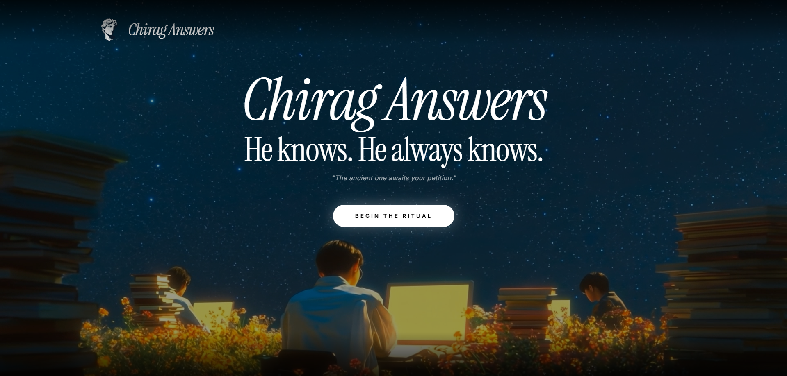

# 🔮 Chirag Answers

> "He knows. He always knows."

A cinematic, mystical prank application designed to wow and baffle. Chirag Answers is a modern take on the classic "virtual tarot" or "secret knowledge" prank, powered by AI and clever deceptive inputs.



## 🎭 The Prank
The application features a "Secret Mode" triggered during the **Ritual Petition**. By typing a period (`.`) at any point in the petition, the input field stops displaying what you type and instead shows the standard mystical petition. Your true typing is secretly captured and used as the answer.

If you don't use the secret mode, the application invokes **Chirag** (powered by Gemini 2.0 Flash) to provide a ritualistic, cryptic, and often unhinged answer to your question.

## ✨ Features
- **Cinematic Experience:** High-contrast, glassmorphic UI with a beautiful celestial background.
- **Ritual Flow:** A two-step process (Petition & Question) designed to build anticipation.
- **AI-Powered:** Deeply integrated with OpenRouter/Gemini 2.0 Flash for mystical oracular responses.
- **Offline Reliability:** If the API is unavailable, the application automatically falls back to your secretly typed answer.
- **Validation System:** Visual notifications guide the user through the ritual requirements.

## 🛠️ Tech Stack
- **Framework:** React + Vite
- **Language:** TypeScript
- **Styling:** Tailwind CSS + Lucide React
- **Typography:** Instrument Serif (Italic) & Custom Monospace
- **API:** OpenRouter (Gemini 2.0 Flash 001)

## 🚀 Setup & Installation

1. **Clone the repository:**
   ```bash
   git clone <your-repo-url>
   cd chirag-answers
   ```

2. **Install dependencies:**
   ```bash
   npm install
   ```

3. **Configure Environment:**
   Create a `.env` file in the root directory (already added to .gitignore):
   ```env
   VITE_OPENROUTER_API_KEY=your_api_key_here
   ```

4. **Run Development Server:**
   ```bash
   npm run dev
   ```

5. **Build for Production:**
   ```bash
   npm run build
   ```

## 📜 Acknowledgments
Inspired by the timeless tradition of virtual oracles, transformed for 2026 with modern AI and premium aesthetics.

---

*Note: This is a prank tool. Use responsibly!*
